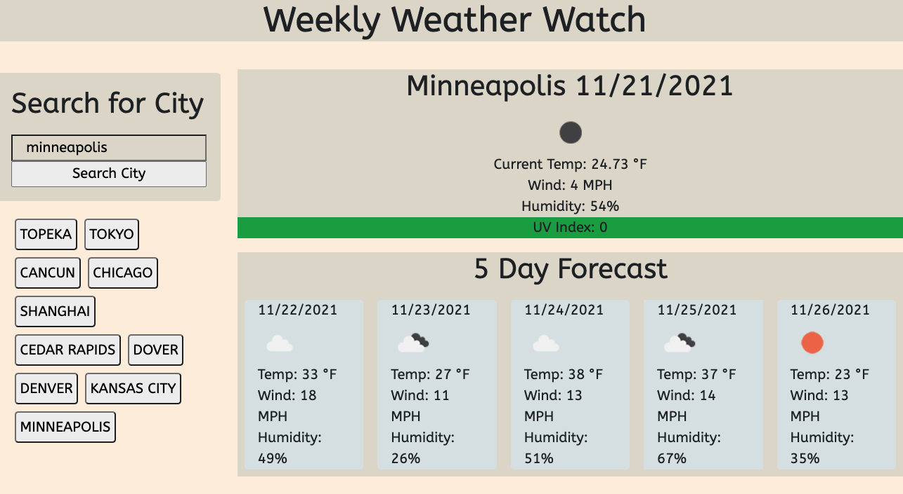

# Weekly Weather Watch

Weekly Weather Watch is a web application used for displaying weekly weather information for different cities around the world. Two Open Weather API calls are made to gather current and forecasted weather information for the next five days. The ten most recent searches show up as buttons under the search box. Client side storage is used for saving city search history.

I built this with Open Weather API, HTML, JavaScript, CSS, Bootstrap, and Google Fonts. I used a color pallete that can be found at https://www.canva.com/colors/color-palettes/vintage-pastels/.

Please submit an issue if you see a bug or a suggested improvement.

## Deployment

https://josh2100.github.io/weekly-weather-watch/

## Screenshot

